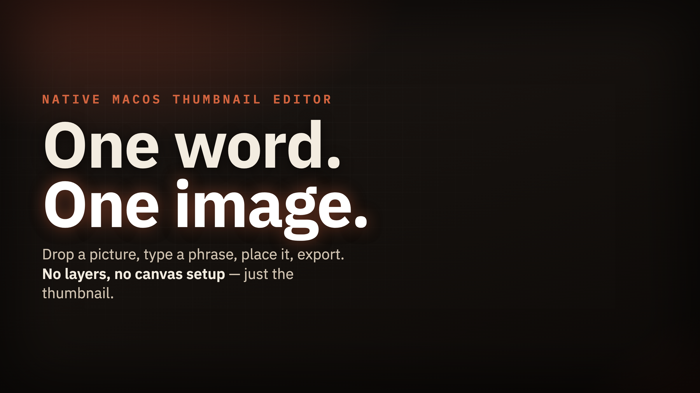

<!-- article:image-slot name="hero" -->
<picture>
  <source media="(prefers-color-scheme: dark)" srcset="docs/images/hero/image.png">
  <source media="(prefers-color-scheme: light)" srcset="docs/images/hero/image.png">
  
</picture>
<!-- /article:image-slot -->

If you make content, you know the feeling. You finish a project, and the last hurdle is a thumbnail. You just need something clean and striking, so you open Photoshop, Figma, or Canva. Those are great tools, but for snapping a single word onto an image they can feel like overkill: layers, bounding boxes, canvas resizing, heavy memory, all to test one idea. I wanted a frictionless way to try thumbnail ideas instead. Just a window where I drop or paste an image, type a word, and see how it looks. So I built Thumbcraft, a small native macOS thumbnail editor for fast text-overlay iteration.

## What Thumbcraft Does

Thumbcraft is a lightweight, completely native macOS tool for fast text-overlay iteration. Built in Swift, it launches instantly and uses barely any resources. Instead of a blank slate with infinite options, it gives you one fluid workflow: drop or paste an image, set a word, pick a look, place it, export. It is not a layered design editor or a vector tool. It does one job, putting striking text on an image quickly, and gets out of your way.

## Run

```bash
swift run
```

## Build A macOS App Bundle

```bash
./Scripts/package-app.sh
open .build/release/Thumbcraft.app
```

## How It Works

You bring an image into the window by dragging it in, pasting from the clipboard with Command-V, or picking it from disk. The window opens to a drop zone, so there is no project setup and no canvas dimensions to fill in. The image you bring is the canvas.

Then you type your short phrase or keyword. The editor treats that text as the focus of the layout, not as one more object floating in a scene.

Instead of hunting through a font drop-down, you pick from three preset visual profiles: Minimal, Catchy, and Modern. Each is a curated starting point you commit to with one click, so the question shifts from "which of hundreds of fonts" to "which of these three directions fits this thumbnail."

From there you get direct control over the dials that matter: toggle uppercase, adjust text size, set outline thickness, restrict the text box width, and change color. You can paste or drop extra image layers, like logos or product shots, and drag them into place. Thumbcraft also supports a picture outline that frames the whole image, and a curved attention arrow you drag to point at the important part. New arrows start with the active text color and carry an adjustable outline so they stay readable over busy images. By default the picture outline matches your text color so the frame and the words read as one decision, and you can unlock it to set it independently.

Positioning is direct: grab the text box, arrow, or pasted layer and drag it over the preview to where it looks right. No coordinate fields, no alignment menus. You move it, watch it land, and let go.

<!-- article:image-slot name="body-1" -->

<!-- /article:image-slot -->

## The Engineering Detail That Makes The Preview Honest

In a lightweight window you work against a scaled-down preview, and the real image can be far larger than the box you drag text around in. Hardcode pixel coordinates against that preview and the export looks wrong, because positions that made sense at preview scale mean something else at full resolution.

So Thumbcraft stores text placement relative to the image dimensions, not in absolute preview pixels. The spot you drag to is recorded as a relationship to the image itself. No matter how large the original is, the exported PNG matches the layout you saw, rendered at full resolution. What you place is what you get, at full crispness, so the drag-to-place loop stays fast: you never export, check, and come back to fix a placement that drifted.

## Why I Built This

The large design suites are not the problem. The friction is reaching for one of them when all you want is to put a word on an image and see if it lands. Deciding up front on three profiles instead of an open font picker, and a handful of dials instead of an endless panel, removes the analysis paralysis of a blank slate. Going native in Swift came from the same call: a tool meant to feel instant has to actually be instant, so it launches immediately and stays light.

<!-- article:image-slot name="body-2" -->

<!-- /article:image-slot -->

## When To Reach For Thumbcraft

Thumbcraft is built for a specific moment, not for every image task. Reach for it when:

- You make content and need a clean, fast, striking thumbnail at the end of a project.
- You want to iterate on a text overlay quickly, trying a word and a look in seconds.
- You are on a Mac and want a native tool that launches instantly and stays light.
- You would rather pick from a few curated profiles than hunt through a font list.

If you need layers, vector editing, or complex compositing, the big tools are still the right call. Thumbcraft is for the last-hurdle case: image in, word on, placed by hand, exported as a PNG. It is open-source on GitHub: run it with `swift run`, or use the included package script to build a native `.app`.

## Built with Claude Code

This tool was designed, written, and iterated on with [Claude Code](https://claude.com/claude-code) as the primary author.

<!-- article:v1 -->
